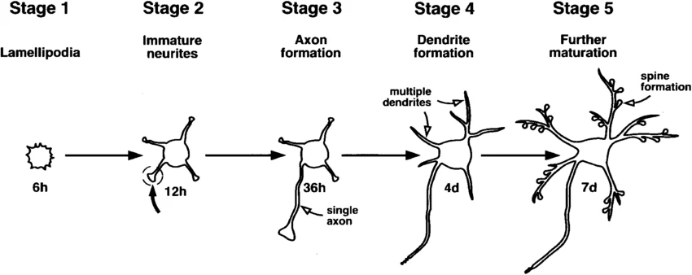

# How Genes Shape Neuronal Morphology, Synapse Formation, and Neural Connectivity

## Table of Contents

- [How Genes Shape Neuronal Morphology, Synapse Formation, and Neural Connectivity](#how-genes-shape-neuronal-morphology-synapse-formation-and-neural-connectivity)
  - [Table of Contents](#table-of-contents)
  - [1. Background: From Gene Expression to Circuit Wiring](#1-background-from-gene-expression-to-circuit-wiring)
    - [1.1 A Minimal Conceptual Framework](#11-a-minimal-conceptual-framework)
    - [1.2 Axon Specification and Outgrowth](#12-axon-specification-and-outgrowth)
    - [1.3 Axon Guidance](#13-axon-guidance)
    - [1.4 Synapse Formation and Synaptic Specificity](#14-synapse-formation-and-synaptic-specificity)
    - [1.5 Activity-Dependent Refinement](#15-activity-dependent-refinement)
  - [2. Biological Case Studies](#2-biological-case-studies)
    - [2.1 Eph/Ephrin Signaling and Topographic Mapping](#21-ephephrin-signaling-and-topographic-mapping)
      - [Canonical Example: Retinotectal Mapping](#canonical-example-retinotectal-mapping)
      - [Key Message](#key-message)
      - [**The Logic of Repulsive Guidance**](#the-logic-of-repulsive-guidance)
    - [2.2 Beat/Side Recognition in the Drosophila Visual System](#22-beatside-recognition-in-the-drosophila-visual-system)
      - [Connectome + Transcriptome Integration](#connectome--transcriptome-integration)
      - [What Carrier et al. Added](#what-carrier-et-al-added)
      - [Broader Significance](#broader-significance)
  - 
    - [2.3 Rewiring an Olfactory Circuit by Altering Cell-Surface Codes](#23-rewiring-an-olfactory-circuit-by-altering-cell-surface-codes)
      - [System](#system)
      - [Main Idea](#main-idea)
      - [Significance](#significance)
  - [3. Simple Modeling Frameworks](#3-simple-modeling-frameworks)
    - [3.1 Bilinear Models of Connectivity](#31-bilinear-models-of-connectivity)
      - [Core Idea](#core-idea)
      - [Interpretation](#interpretation)
      - [Representative Studies](#representative-studies)
      - [Why This Model Matters](#why-this-model-matters)
    - [3.2 Biclique / Modular Wiring Models](#32-biclique--modular-wiring-models)
    - [3.3 Spatial and Developmental Inference Frameworks](#33-spatial-and-developmental-inference-frameworks)
      - [Ligand-Receptor Inference Across Development](#ligand-receptor-inference-across-development)
      - [Chemoaffinity-Inspired Spatial Gradient Models](#chemoaffinity-inspired-spatial-gradient-models)
      - [Connectopic Axes and Genetic Topography](#connectopic-axes-and-genetic-topography)
      - [Methodological Takeaway](#methodological-takeaway)
  - [4. Potential Applications](#4-potential-applications)
    - [4.1 Interpreting Developmental Variability](#41-interpreting-developmental-variability)
      - [Why This Matters for GeneWeave](#why-this-matters-for-geneweave)
    - [4.2 Broader Relevance](#42-broader-relevance)
      - [Disease Mechanisms](#disease-mechanisms)
      - [Regeneration and Repair](#regeneration-and-repair)
      - [AI and Theoretical Neuroscience](#ai-and-theoretical-neuroscience)
  - [5. Take-Home Messages](#5-take-home-messages)
    - [A Practical Synthesis](#a-practical-synthesis)
  - [References](#references)
    - [Background Papers](#background-papers)
    - [Case Studies](#case-studies)
    - [Modeling](#modeling)
    - [Applications](#applications)

---

## 1. Background: From Gene Expression to Circuit Wiring

### 1.1 A Minimal Conceptual Framework

Neural wiring is not random. Across development, gene-regulatory programs constrain:

- neuronal polarity and axon specification
- axon pathfinding toward appropriate target regions
- target recognition and synaptic partner selection
- synapse maturation, refinement, and stabilization

At a coarse level, the logic can be summarized as:

$$
\text{Developmental signals} \rightarrow \text{gene regulation} \rightarrow \text{cell-surface and cytoskeletal programs} \rightarrow \text{wiring outcomes}
$$

### 1.2 Axon Specification and Outgrowth

During early neuronal development, one neurite is specified as the axon, whereas the remaining neurites adopt dendritic identity.

Key molecular layers include:

- **Polarity signaling**: PI3K/PTEN, Par complex, LKB1, and small GTPases such as Rac, Rho, and Cdc42.
- **Cytoskeletal remodeling**: localized regulation of actin and microtubule dynamics biases one neurite toward axonal fate.
- **Transcriptional control**: transcription factors induce downstream programs for adhesion molecules, guidance receptors, motor proteins, and structural components.

<!--  -->

<!--  -->
<!-- Figure 9. Stages of development of hippocampal neurons in culture. The approximate times at which cells enter each of the stages is indicated. -->
  
[The establishment of polarity by hippocampal neurons in culture](https://www.jneurosci.org/content/8/4/1454)
<!-- image.png -->

### 1.3 Axon Guidance

Once specified, the axon navigates through molecular gradients and intermediate guidepost environments.

Major guidance systems include:

| Cue family | Receptors | Canonical function |
|------|------|------|
| **Netrin** | DCC, UNC5 | Attraction / repulsion |
| **Slit** | Robo | Midline repulsion |
| **Semaphorin** | Plexin, Neuropilin | Repulsion / context-dependent attraction |
| **Eph/Ephrin** | Eph receptors | Topographic mapping, mostly repulsive signaling |

The growth cone converts extracellular cues into directional movement through intracellular signaling and cytoskeletal reorganization.

### 1.4 Synapse Formation and Synaptic Specificity

After reaching a target region, axons still need to identify the correct postsynaptic partners.

This process depends heavily on **synaptic adhesion molecules (SAMs)** and related recognition systems:

- **Neurexin / Neuroligin**
- **Protocadherins**
- **Ig superfamily recognition molecules**
- additional cell-surface organizers and scaffold-associated proteins

These molecules do not merely glue cells together; they help define:

- who connects to whom
- where the connection is placed
- how the synapse matures functionally

### 1.5 Activity-Dependent Refinement

Initial wiring is subsequently refined by neural activity.

Activity-dependent signaling regulates:

- synapse stabilization
- synapse elimination and pruning
- synaptic efficacy and plasticity

Thus, final connectivity reflects both **genetically encoded developmental programs** and **activity-dependent refinement**.

From [Hebbian instruction of axonal connectivity by endogenous correlated spontaneous activity](https://www.science.org/doi/10.1126/science.adh7814)
<!-- Hebbian instruction of axonal connectivity by endogenous correlated spontaneous activity -->

---

## 2. Biological Case Studies

### 2.1 Eph/Ephrin Signaling and Topographic Mapping

#### Canonical Example: Retinotectal Mapping

**Reference**: Brown et al., *Cell* (2000)  
**Related references**: Koike et al., *PNAS* (2025); *Journal of Neuroscience* (2024)

<!-- Brown et al., Cell 2000 ("Topographic Mapping from the Retina to the Midbrain") -->

In the vertebrate visual system, retinal ganglion cell (RGC) axons must map onto the superior colliculus / tectum in a topographically ordered manner.

Core logic:

1. **Environmental gradient**  
   Ephrin-A is expressed in a graded fashion across the target field.

2. **Receptor gradient**  
   EphA receptors are expressed at different levels across retinal neurons.

3. **Repulsion-based mapping**  
   Axons with higher EphA levels are more sensitive to ephrin-A-mediated repulsion and terminate more anteriorly, whereas axons with lower EphA levels extend further posteriorly.

This can be summarized conceptually as:

$$
\text{Projection coordinate} \propto \frac{\text{EphA receptor level}}{\text{local ephrin-A landscape}}
$$

#### Key Message

Eph/Ephrin signaling provides a classic example of how **graded gene expression is translated into spatially ordered connectivity**.

Target-Independent EphrinA/EphA-Mediated Axon-Axon Repulsion as a Novel Element in Retinocollicular Mapping

**Topographic Mapping: Retina to Superior Colliculus (SC)**

| **Source (Retina)** | **Target (Superior Colliculus / Tectum)** |
| :--- | :--- |
| **EphA Gradient**  | **Ephrin-A Gradient** |
| Low $\rightarrow$ High | Low $\rightarrow$ High (**Posterior**) |
<!-- | **EphA Gradient:** ░░▒▒▓▓ | **Ephrin-A Gradient:** ░░▒▒▓▓ | -->

---

#### **The Logic of Repulsive Guidance**

* **High EphA Axons** (Temporal Retina)
    * **Mechanism:** Strongly repelled by even low concentrations of Ephrin-A.
    * **Termination:** Restricted to the **Anterior** region (where Ephrin-A levels are lowest).
* **Low EphA Axons** (Nasal Retina)
    * **Mechanism:** Minimal sensitivity to Ephrin-A-mediated repulsion.
    * **Termination:** Permitted to extend further into the **Posterior** region (where Ephrin-A levels are highest).
 

<!-- #### Suggested Figures

- schematic of retinotectal topographic mapping
- EphA and ephrin-A gradients
- wild-type versus mutant projection patterns -->

<!-- 
Sperry versus Hebb: Topographic mapping in Isl2/EphA3 mutant mice -->

---

 
### 2.2 Beat/Side Recognition in the Drosophila Visual System

#### Connectome + Transcriptome Integration

**References**:  
Yoo et al., *Current Biology* (2023)  
Carrier et al., *Developmental Cell* (2025)  
Tan et al., *Cell* (2015)

This system provides a strong example of how gene expression helps define **layer-specific synaptic wiring**.

The relevant circuit includes:

- **T4/T5 neurons**, which encode motion direction
- **LPLC neurons**, which act as downstream partners

Yoo et al. combined connectomics and transcriptomics to identify candidate determinants of selective connectivity. A central result was the association between **Side** ligands and **Beat** receptors.

Conceptually:

$$
\text{Subtype-specific ligand expression} + \text{partner-specific receptor expression} \rightarrow \text{biased connectivity}
$$

One illustrative example is the selective association between **Side-II** and **Beat-VI**, which helps explain why particular T4/T5 subtypes preferentially connect to specific downstream partners.

#### What Carrier et al. Added

Carrier et al. refined the interpretation:

- Beat/Side interactions are **not strictly required** for synapse formation itself.
- Instead, they bias **cellular adjacency** before synaptogenesis.
- In other words, these molecules help organize the spatial preconditions for specific wiring.

This leads to a useful developmental model:

$$
\text{Adhesion bias} \rightarrow \text{spatial proximity} \rightarrow \text{increased probability of specific synapse formation}
$$

#### Broader Significance

This work shifts the framing from a simplistic "one molecule = one synapse" view toward a more realistic developmental interpretation:

- some molecules specify direct partner recognition
- others bias geometry, layer targeting, or cellular neighborhood structure

<!-- #### Suggested Figures

- T4/T5 subtype projections across layers
- Side / Beat expression patterns
- connectivity matrix between T4/T5 and downstream cell types
- wild-type versus perturbation phenotypes -->

---

  
### 2.3 Rewiring an Olfactory Circuit by Altering Cell-Surface Codes

**References**:   

[Dimensionality reduction simplifies synaptic partner matching in an olfactory circuit](https://www.science.org/doi/10.1126/science.ads7633) 
Lyu et al., *Science* (2025)

[Rewiring an olfactory circuit by altering cell-surface combinatorial code](https://www.nature.com/articles/s41586-025-09769-3) 
Zhu et al., *Nature* (2025)

This study from the Liqun Luo group addresses a powerful causal question:

> Can neural connectivity be reprogrammed by modifying the combinatorial code of cell-surface molecules?

#### System

In the Drosophila olfactory system:

- olfactory receptor neurons (ORNs) project to defined glomeruli
- within each glomerulus, ORNs interact with specific partner neurons

#### Main Idea

The study integrates two levels of developmental logic:

1. **Axon targeting**  
   transcriptional programs regulate expression of guidance and surface molecules, influencing glomerular targeting

2. **Partner matching**  
   local cell-surface recognition systems shape which neurons form synapses with one another

By experimentally altering the surface-molecule combination expressed by a given ORN class, the authors were able to alter:

- axonal targeting patterns
- aspects of postsynaptic partner selection

#### Significance

This is a strong demonstration that combinatorial surface identity is not merely correlated with connectivity, but can be **causally instructive**.

It also provides one of the clearest bridges between:

- developmental gene regulation
- cell-surface molecular codes
- circuit-level wiring specificity

<!-- #### Suggested Figures

- organization of the Drosophila olfactory pathway
- wild-type versus rewired ORN projection patterns
- altered surface-molecule expression profiles
- changes in downstream partner matching -->

---

## 3. Simple Modeling Frameworks

### 3.1 Bilinear Models of Connectivity

#### Core Idea

If connectivity depends on interactions between presynaptic and postsynaptic gene-expression profiles, a natural first model is bilinear:

$$
P(i \rightarrow j) = \sigma \left(g_i^{T} W g_j + b\right)
$$

where:

- $g_i$ is the gene-expression vector of presynaptic neuron $i$
- $g_j$ is the gene-expression vector of postsynaptic neuron $j$
- $W$ is a learned gene-gene interaction matrix
- $\sigma$ is a nonlinear link function, typically sigmoid

Expanded form:

$$
P(i \rightarrow j) = \sigma \left(\sum_{\alpha}\sum_{\beta} W_{\alpha\beta} g_i^\alpha g_j^\beta + b\right)
$$

#### Interpretation

Each entry $W_{\alpha\beta}$ represents the contribution of a presynaptic gene $\alpha$ interacting with a postsynaptic gene $\beta$.

- positive values favor connectivity
- negative values disfavor connectivity

#### Representative Studies

**Kovács et al., PNAS (2020)**  
*Uncovering the genetic blueprint of the C. elegans nervous system*

Key point:

- a relatively small subset of gene-gene interactions explains a substantial fraction of observed connectivity

**Qiao, eLife Reviewed Preprint (2023)**  
*Deciphering the Genetic Code of Neuronal Type Connectivity: A Bilinear Modeling Approach*

Key point:

- bilinear structure can be extended to type-level connectivity and more structured inference

#### Why This Model Matters

- biologically interpretable
- naturally aligned with ligand-receptor-like logic
- simple enough to serve as a first mechanistic model

<!-- #### Suggested Figures

- schematic of bilinear gene-to-connection inference
- heatmap of the learned interaction matrix
- performance curve or example recovered gene pairs -->

Method: 

Result:

---

### 3.2 Biclique / Modular Wiring Models

**Reference**: Barabási et al., *Neuron* (2019)  
[*A Genetic Model of the Connectome*](https://www.cell.com/neuron/fulltext/S0896-6273(19)30926-2)

This framework emphasizes **modular structure** rather than isolated pairwise edges.

Suppose:

- a presynaptic group $A$
- a postsynaptic group $B$
- many neurons in $A$ connect broadly to many neurons in $B$

This forms a **biclique-like motif**, suggesting that shared gene programs may specify connectivity at the level of cell groups or modules.

Conceptually:

$$
\text{Connectivity module} \leftrightarrow \text{shared molecular program}
$$

This is useful because real circuits are often organized by:

- cell types
- layers
- developmental lineages
- recurrent modular motifs

<!-- #### Suggested Figures

- schematic of a biclique motif
- module-level connectivity pattern
- mapping from gene modules to connectivity modules -->

### 3.3 Spatial and Developmental Inference Frameworks

The previous two frameworks focus on **pairwise molecular interactions** or **module-level wiring rules**. A complementary line of work asks whether connectivity can be explained from:

- **ligand-receptor communication**
- **spatial gene-expression gradients**
- **topographic axes of wiring space**

These approaches are especially useful when the goal is not only to predict whether two neurons connect, but also to explain how wiring is constrained by developmental geometry and large-scale molecular organization.

#### Ligand-Receptor Inference Across Development

**Reference**: Telley and de Chevigny, *Nature Communications* (2026)  
[*Uncovering the molecular logic of cortical wiring between neuronal subtypes across development through ligand-receptor inference*](https://www.nature.com/articles/s41467-025-68059-8)

This framework starts from a biologically explicit assumption:

$$
\text{Wiring propensity} \sim \text{compatibility of ligand-receptor programs across cell types and developmental stages}
$$

At a high level, the method:

1. quantifies ligand and receptor expression across neuronal subtypes
2. aggregates candidate ligand-receptor interactions into subtype-pair scores
3. tests whether these scores can explain developmental changes in cortical wiring

Methodologically, this is attractive because it maps naturally onto known cell-cell communication biology. It also narrows the hypothesis space from all possible genes to a functionally interpretable subset.

**Figure links**:

- [Nature Communications Fig. 1](https://www.nature.com/articles/s41467-025-68059-8/figures/1): developmental transcriptomic atlas used as the basis for ligand-receptor inference
- [Nature Communications Fig. 4](https://www.nature.com/articles/s41467-025-68059-8/figures/4): subtype wiring logic and inferred interaction structure
- [Nature Communications Fig. 5](https://www.nature.com/articles/s41467-025-68059-8/figures/5): experimental support for inferred developmental wiring programs

#### Chemoaffinity-Inspired Spatial Gradient Models

**Reference**: Koike et al., *PNAS* (2026)  
[*A data-driven framework linking the connectome to spatial gene expression gradients inspired by chemoaffinity theory*](https://www.pnas.org/doi/full/10.1073/pnas.2516572123)

This work revisits the classical chemoaffinity idea in a modern data-driven form. Instead of treating connectivity as only a pairwise matching problem, it models wiring relative to **continuous spatial gene-expression gradients**.

Conceptually:

$$
\text{Connectivity} \sim f(\text{position in gradient space}, \text{molecular compatibility})
$$

The central methodological move is to embed neurons or regions into a spatially organized molecular coordinate system, then ask whether connectivity is better explained by proximity or alignment in that gene-gradient space.

This is important because many developmental wiring problems are fundamentally geometric:

- target selection occurs in space
- guidance cues are graded rather than binary
- neighboring cells often share related molecular environments

**Figure links**:

- [PNAS article](https://www.pnas.org/doi/full/10.1073/pnas.2516572123): main paper page for figures and supplementary materials
- [Related chemoaffinity preprint resource](https://www.biorxiv.org/content/10.1101/2025.04.30.651442v1): accessible figure source closely related to the same chemoaffinity-based modeling direction

#### Connectopic Axes and Genetic Topography

**Reference**: *Journal of Neuroscience* (2024)  
[*Topographic Axes of Wiring Space Converge to Genetic Topography in Shaping the Human Cortical Layout*](https://www.jneurosci.org/content/45/7/e1510242024)

This line of work moves to a more systems-level description. Rather than modeling individual molecular pairs, it constructs **topographic axes of wiring space** and compares them with large-scale **genetic topography**, including global connectopies.

The underlying idea can be summarized as:

$$
\text{macroscopic wiring axes} \leftrightarrow \text{macroscopic transcriptional axes}
$$

Methodologically, this usually involves:

- deriving low-dimensional axes from connectivity structure
- deriving low-dimensional axes from transcriptomic organization
- quantifying convergence between the two spaces

This approach is especially useful for human or mesoscale data, where exact cell-to-cell synaptic wiring may be unavailable, but region-level organization is measurable.

**Figure links**:

- [PMC full article](https://pmc.ncbi.nlm.nih.gov/articles/PMC11823343/): accessible version with full figures
- [JNeurosci figures/data page](https://www.jneurosci.org/content/45/7/e1510242024/tab-figures-data): official figure index
- [Journal PDF](https://www.jneurosci.org/content/jneuro/45/7/e1510242024.full.pdf): convenient source for extracting figure panels

#### Methodological Takeaway

Together, these three papers expand the modeling landscape beyond bilinear inference:

| Framework | Main unit of analysis | Core idea |
|------|------|------|
| **Ligand-receptor inference** | cell-type pairs | infer wiring from molecular communication programs |
| **Chemoaffinity gradient model** | spatially embedded neurons or regions | infer wiring from alignment in gene-gradient space |
| **Connectopic / topographic model** | large-scale cortical axes | relate wiring geometry to transcriptional geometry |

In practice, these frameworks are complementary:

- **bilinear models** are strongest when cell-level transcriptomes and connectivity are available
- **ligand-receptor inference** adds mechanistic biological priors
- **gradient and connectopic models** capture spatial organization that pairwise models may miss

---

## 4. Potential Applications

### 4.1 Interpreting Developmental Variability

**Reference**: Lachi et al., bioRxiv (2024)  
[*Stochastic Wiring of Cell Types Enhances Fitness by Generating Phenotypic Variability*](https://www.biorxiv.org/content/10.1101/2024.08.07.606541v1)

This work raises an important conceptual point:

> genetically specified wiring rules do not necessarily imply fully deterministic wiring outcomes

Instead, development may combine:

- genetically encoded connection probabilities
- stochastic realization at the circuit level

This can generate phenotypic variability that may be beneficial under changing environments.

Methodologically, this perspective is important because it changes what a successful model should predict. In some systems, the goal may not be a single deterministic adjacency matrix, but rather a **distribution over plausible circuit realizations**:

$$
\text{genetic program} \rightarrow \text{connection probability landscape} \rightarrow \text{individual circuit instance}
$$

This is especially relevant when comparing:

- stereotyped systems such as *C. elegans*
- partially stereotyped insect circuits
- higher-variance mammalian circuits

#### Why This Matters for GeneWeave

If connectivity is partly probabilistic, then transcriptomic features may be most informative when used to predict:

- connection probability
- motif enrichment
- subtype-specific biases
- variance across individuals or developmental conditions

### 4.2 Broader Relevance

Potential application domains include:

- **neurodevelopmental disorders**: linking synaptic adhesion and wiring defects to disease
- **regenerative neuroscience**: re-establishing correct connectivity after injury
- **brain-machine interfaces**: improving integration with biological circuits
- **artificial intelligence**: extracting structured wiring principles for efficient architectures
- **synthetic neurobiology**: reprogramming or engineering circuit-level specificity

#### Disease Mechanisms

Many neurodevelopmental and neuropsychiatric disorders are increasingly interpreted through the lens of circuit assembly defects. In that context, gene-to-connectivity frameworks can help bridge:

- risk genes
- altered developmental programs
- abnormal connectivity phenotypes

This is especially relevant for genes involved in:

- synaptic adhesion
- axon guidance
- dendritic development
- activity-dependent plasticity

#### Regeneration and Repair

A mechanistic understanding of wiring rules could eventually support strategies for:

- rerouting regenerating axons
- promoting correct target recognition after injury
- biasing synapse formation toward functional reassembly rather than maladaptive rewiring

#### AI and Theoretical Neuroscience

These studies also suggest that biological circuits may be constrained by low-dimensional rules rather than arbitrary dense connectivity. That idea is attractive for machine learning because it points toward:

- structured sparsity
- modular architectures
- developmental priors
- probabilistic wiring rules instead of fully unconstrained parameterization

---

## 5. Take-Home Messages

1. **Genes influence neural wiring at multiple levels**: polarity, axon guidance, target recognition, synaptogenesis, and refinement.
2. **Cell-surface recognition systems are central** to synaptic specificity, but often act together with geometry, timing, and activity.
3. **Eph/Ephrin, Beat/Side, and olfactory rewiring experiments** provide complementary examples of how gene expression shapes connectivity.
4. **Bilinear, modular, ligand-receptor, and gradient-based models** each capture different aspects of the same problem and should be viewed as complementary rather than competing.
5. **The next step is not just description, but prediction**: from transcriptomic state to connection probability, spatial targeting, and circuit architecture.
6. **The long-term goal** is to move from descriptive molecular atlases toward predictive and eventually programmable theories of circuit assembly.

### A Practical Synthesis

For a project such as GeneWeave, a useful working hierarchy may be:

1. use **bilinear models** for interpretable pairwise inference
2. use **ligand-receptor priors** to constrain biologically plausible interactions
3. use **spatial-gradient and connectopic models** to capture geometry and topography
4. use **stochastic formulations** when the biological system is not fully deterministic

This synthesis makes it possible to connect developmental biology, connectomics, and computational modeling within one coherent framework.

---

## References

### Background Papers

1. Südhof, T. C. *The cell biology of synapse formation: mechanisms of synaptic specificity.* *J Cell Biol* (2021).
2. Sanes, J. R. and Zipursky, S. L. *Synaptic specificity, recognition molecules, and assembly of neural circuits.* *Cell* (2020).

### Case Studies

3. Brown, A. et al. *Topographic Mapping from the Retina to the Midbrain Is Controlled by Relative but Not Absolute Levels of EphA Receptor Signaling.* *Cell* (2000).
4. Koike, J. et al. *A data-driven framework linking the connectome to spatial gene expression gradients inspired by chemoaffinity theory.* *PNAS* (2025).
5. Yoo, J. et al. *Brain wiring determinants uncovered by integrating connectomes and transcriptomes.* *Current Biology* (2023).
6. Carrier, Y. et al. *Biased cell adhesion organizes the Drosophila visual motion integration circuit.* *Developmental Cell* (2025).
7. Tan, L. et al. *Ig superfamily ligand and receptor pairs expressed in synaptic partners in Drosophila.* *Cell* (2015).
8. Zhu, Z. et al. *Rewiring an olfactory circuit by altering the combinatorial code of cell-surface proteins.* *Nature* (2026).

### Modeling

9. Kovács, I. A. et al. *Uncovering the genetic blueprint of the C. elegans nervous system.* *PNAS* (2020).
10. Qiao, M. et al. *Deciphering the Genetic Code of Neuronal Type Connectivity: A Bilinear Modeling Approach.* *eLife Reviewed Preprint* (2023).
11. Barabási, D. L. et al. *A Genetic Model of the Connectome.* *Neuron* (2019).
12. Telley, L. and de Chevigny, A. *Uncovering the molecular logic of cortical wiring between neuronal subtypes across development through ligand-receptor inference.* *Nature Communications* (2026).
13. Koike, J. et al. *A data-driven framework linking the connectome to spatial gene expression gradients inspired by chemoaffinity theory.* *PNAS* (2026).
14. *Topographic Axes of Wiring Space Converge to Genetic Topography in Shaping the Human Cortical Layout.* *Journal of Neuroscience* (2024).

### Applications

15. Lachi, D. et al. *Stochastic Wiring of Cell Types Enhances Fitness by Generating Phenotypic Variability.* bioRxiv (2024).

---

<!-- *English presentation draft v1*   -->
<!-- *Refined from the Chinese outline and background notes* -->
