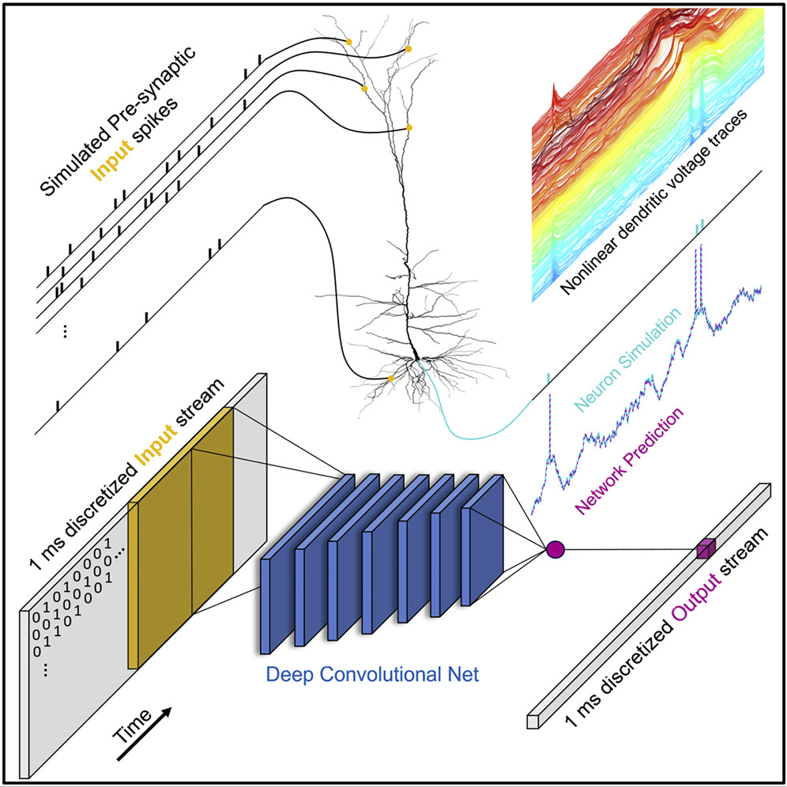
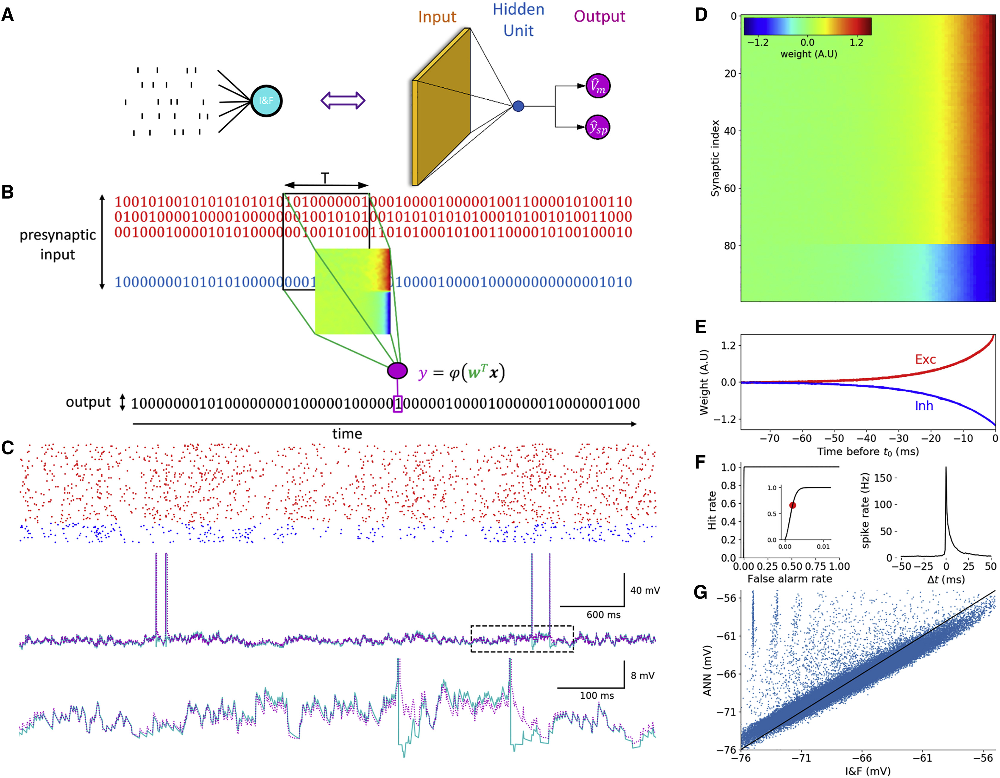

# Single cortical neurons as deep artificial neural networks

https://www.sciencedirect.com/science/article/pii/S0896627321005018

github:
https://github.com/SelfishGene/neuron_as_deep_net

dataset:
https://www.kaggle.com/datasets/selfishgene/single-neurons-as-deep-nets-nmda-test-data

## summary
- Cortical neurons are well approximated by a deep neural network (DNN) with 5–8 layers
- DNN’s depth arises from the interaction between NMDA receptors and dendritic morphology
- Dendritic branches can be conceptualized as a set of spatiotemporal pattern detectors
- We provide a unified method to assess the computational complexity of any neuron type

these inputs interact with a plethora of local nonlinear regenerative processes, including the back-propagating (Na+-dependent) action potential (Stuart and Sakmann, 1994), the multiple local dendritic NMDA-dependent spikes (Schiller et al., 2000; Polsky et al., 2004; Branco et al., 2010; Kastellakis et al., 2015), and the large and prolonged Ca2+ spike at the apical dendrite of layer 5 (L5) cortical pyramidal neurons (Schiller et al., 1997; Larkum et al., 1999).

see recent work on nonlinear dendritic computations in human cortical neurons in Gidon et al., 2020
- [Dendritic action potentials and computation in human layer 2/3 cortical neurons](https://www.science.org/doi/full/10.1126/science.aax6239)

the fine electrical and anatomical details of the neurons using the cable and compartmental modeling methods introduced by Rall (Rall, 1959, 1964; Segev and Rall, 1988).

## introduction
| Method | Model | Author + Time | More Detail |
|---------------------------------|--------------------------------|--------------------------------------------------------|---------------------------------------------------------------------------------------------------|
| Classical Approach | Phenomenological Abstraction | Lapicque, 1907; McCulloch and Pitts, 1943 | Simplified models omitting detailed biological mechanisms. |
| | Perceptron | Rosenblatt, 1958 | Linear summation and thresholding, ignoring nonlinear synaptic integration. |
| Advanced Models | Nonlinear Synaptic Integration | Gütig and Sompolinsky, 2006; Poirazi et al., 2003a | Address nonlinear synaptic inputs and temporal precision. |
| | | Polsky et al., 2004; Ujfalussy et al., 2018 | Often lack diverse synaptic input consideration or millisecond precision. |
| Somatic Input Models | Spiking Activity Prediction | Jolivet et al., 2008; Naud et al., 2014 | Predict spiking activity from somatic input current/conductance. |
| Natural Image Response Models | Spiking Activity Prediction | Cadena et al., 2019; Keat et al., 2001 | Predict spiking activity from natural images. |
| Compartmental and Cable Models | Detailed Neuron Simulation | Rall, 1959, 1964; Segev and Rall, 1988 | Simulate electrical and anatomical neuron details using partial differential equations. |
| | | | Account for full I/O transformation and explore inaccessible conditions. |
| | | | High-dimensional, nonlinear equations difficult to interpret. |
| | | Amsalem et al., 2020; Larkum et al., 2009; etc. | Research references for extracting general principles from detailed simulations. |

## method
temporal-convolutional networks (TCNs)

receiver operator characteristic (ROC) curve of spike prediction. The area under the curve (AUC) is 0.997

### Analogous DNN for the full complexity of the L5 cortical pyramidal neuron models
We next applied our paradigm to a morphologically and electrically complex detailed biophysical compartmental model of a 3D-reconstructed L5 cortical pyramidal cell (L5PC) from rat somatosensory cortex 

The model is equipped with complex nonlinear membrane properties, a somatic spike generation mechanism, and an excitable apical nexus capable of generating calcium spikes (Hay et al., 2011; Larkum et al., 1999; Schiller et al., 1997).

The excitatory synaptic inputs are mediated through both voltage-independent AMPA-based conductance and voltage-dependent NMDA-type conductance (Jahr and Stevens, 1993); the inhibitory inputs are mediated through conductance-based GABAA-type synapses.

(I) An additional unit that is weakly selective to whatever happens in the basal dendrites, weakly sensitive to oblique dendrites, but very sensitive to apical tuft dendrites. 

?? the different position of synapses are important for the final spike generation. the synapses in dendrites just integrate the inputs and the axon will transmit the signal, but synapses in the axon will have a stronger impact on the spike generation.

### NMDA synapses are major contributors to the I/O complexity (“depth”) of L5PCs
the NMDA current has slow dynamics, promoting integration over a time window of tens of milliseconds

### DNN analysis of a single dendritic branch provides new insights for the contribution of NMDA conductance to the computational complexity of neurons
the rich and complex integration of inputs on this dendritic branch, which involved the contribution of the nonlinear NMDA current, can be conceptualized as pattern matching of a set of four specific spatiotemporal templates.

?? how to explain this? 

## question to answer
how to measure the input and output

the computational complexity of any neuron type

