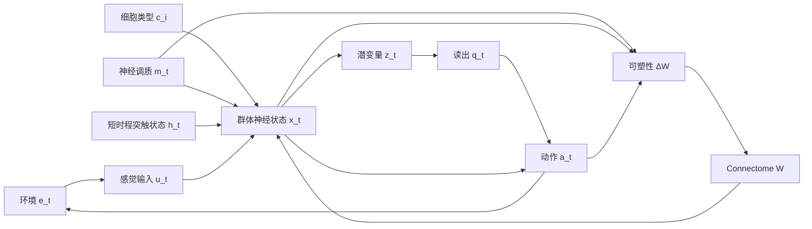
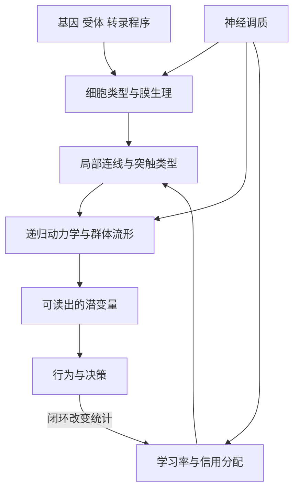

# 截至 2026-06-06 我们能给出的最好答案 大脑如何工作

## 执行摘要

截至 2026 年中，最稳健、最能同时解释大规模记录、connectome、细胞图谱、抑制性回路、表征漂移、网格与位置系统、神经调质以及“神经基础模型”结果的答案，不是“大脑在某个区域里运行单一算法”，而是：**大脑是一个由 connectome 与细胞类型强约束、被抑制与神经调质持续门控、在感觉—动作闭环中运行的多尺度可塑性递归动力系统**。它的计算核心不是单神经元，而是**群体潜变量与低维流形**；它的稳定性不是“每个神经元都稳定”，而是**读出与行为相关的潜在子空间相对稳定，而单元层可显著漂移**；它的学习不是任意改线，而是**在结构先验、E/I 平衡、细胞型特异性可塑性和调质门控下进行的受限重写**。因此，connectome 很重要，但**单靠 connectome 不足以推出功能**；必须再加上细胞类型、突触生理、状态变量、调质与闭环任务约束。这个框架同时解释了：分布式决策信号、经验偏置的 representational drift、局部重锚定的 grid/place coding、抑制性神经元对“增益/时序/可塑性”的三重作用，以及基础模型为何能跨动物、跨刺激域迁移。 citeturn21view0turn22view0turn22view1turn21view1turn21view2turn24view3turn28view0turn28view2turn29view1turn30view1turn30view0turn31view0turn34search0turn33view0turn32view2turn21view4turn17search1

## 精选论文与数据集

下表优先收录了截至目前最能约束“统一工作模型”的一组论文与官方资源；我有意偏向**原始/官方来源**与**因果操控、突触分辨率、脑区尺度记录**。表中“模型维度”指：结构、动力学、可塑性、读出、行为。 citeturn19search1turn19search3turn25view1turn13search6

| 文献或资源 | 规模与技术 | 物种 | 主要经验结论 | 模型维度 |
|---|---|---|---|---|
| *A brain-wide map of neural activity during complex behaviour* (Nature, 2025) citeturn21view0 | 621,733 神经元；699 次 Neuropixels 插入；139 只鼠；279 脑区 | 小鼠 | 视觉、选择、动作、奖励与内部状态相关活动广泛分布；动作前活动几乎全脑可见 | 动力学、读出、行为 |
| *Brain-wide representations of prior information in mouse decision-making* (Nature, 2025) citeturn22view0 | IBL 全脑电生理 + widefield；242 脑区 | 小鼠 | 主观先验并非只在“高层决策区”，而是跨感觉、运动与高级皮层广泛编码 | 动力学、读出、行为 |
| *Brain-wide dynamics linking sensation to action during decision-making* (Nature, 2024) citeturn22view1 | 跨数十脑区大规模群体记录 | 小鼠 | 证据积累与动作准备由分布式群体子空间实现；动作开始时积累子空间塌缩并重置 | 动力学、读出、行为 |
| *Functional connectomics spanning multiple areas of mouse visual cortex* (Nature, 2025) citeturn21view1 | 约 75,000 功能成像神经元；>200,000 细胞；约 5 亿突触；EM + 钙成像 | 小鼠 | 在 1 mm³ 量级把功能与突触级结构直接对齐；是目前最强的“结构—功能”桥梁之一 | 结构、动力学、读出 |
| *Functional connectomics reveals general wiring rule in mouse visual cortex* (Nature, 2025) citeturn21view3 | MICrONS 子集；数字孪生模型 + EM 连接 | 小鼠 | 兴奋性细胞广泛服从“like-to-like”连线；且存在高阶群体级配线规则，不只是成对相似性 | 结构、动力学、可塑性 |
| *Inhibitory specificity from a connectomic census of mouse visual cortex* (Nature, 2025) citeturn21view2 | 连续 1,352 神经元皮层柱；EM 重建；跨层完整树突 | 小鼠 | 抑制性神经元具有细胞型/亚类/亚细胞区室级靶向特异性；发现新的 disinhibitory specialist | 结构、动力学、可塑性 |
| *Neuronal wiring diagram of an adult brain* (Nature, 2024) citeturn24view0 | 139,255 神经元；5×10^7 化学突触；全脑 EM | 果蝇 | 首个成年果蝇全脑 connectome；支持跨脑区路径追踪与 projectome 分析 | 结构、行为 |
| *Whole-brain annotation and multi-connectome cell typing of Drosophila* (Nature, 2024) citeturn24view1 | 全脑 connectome 比较 + 共识细胞类型图谱 | 果蝇 | 给出共识 cell type atlas；提示功能稳态可通过维持 E/I 比而非绝对输入量保持 | 结构、可塑性 |
| *Network statistics of the whole-brain connectome of Drosophila* (Nature, 2024) citeturn24view2 | 全脑图论；78 个 neuropils | 果蝇 | 全脑具有大 rich-club、短路径、高 reciprocity 与高 clustering；反馈与递归 motif 过表达 | 结构、动力学 |
| *Connectome-constrained networks predict neural activity across the fly visual system* (Nature, 2024) citeturn22view2 | 64 细胞类型；connectome-constrained DMN；任务优化 | 果蝇 | 只给 connectome 不够；**connectome + 任务约束** 可预测 ON/OFF 分离和 T4/T5 方向选择性 | 结构、动力学、读出 |
| *A Drosophila computational brain model reveals sensorimotor processing* (Nature, 2024) citeturn23view0turn23view4 | >125,000 神经元；5,000 万突触；LIF 全脑模型 | 果蝇 | 仅依据连线与神经递质身份即可提出可实验验证的感觉到动作假设，但对抑制/调质不足较敏感 | 结构、动力学、行为 |
| *Neural signal propagation atlas of Caenorhabditis elegans* (Nature, 2023) citeturn24view3 | >23,000 对神经元传播测量；光遗传/全脑功能 | 线虫 | **功能传播比 anatomy 更能预测自发动力学**；extrasynaptic neuropeptide signalling 在秒级内已重要 | 动力学、可塑性、行为 |
| *Prediction of neural activity in connectome-constrained recurrent networks* (Nature Neuroscience, 2025) citeturn22view4 | 理论/仿真；student–teacher connectome-constrained RNN | 泛化理论 | connectome 常不足以唯一约束动力学；少量录制即可显著去简并，并指导“该录哪些神经元” | 结构、动力学、读出 |
| *A high-resolution transcriptomic and spatial atlas of cell types in the whole mouse brain* (Nature, 2023) citeturn27search0turn27search12 | >8 百万细胞；scRNA-seq + 空间转录组；~5,300 clusters | 小鼠 | 全脑细胞类型具有强空间特异性与层级分类；为“cell type 是计算基元之一”提供图谱级约束 | 结构、可塑性 |
| ABC Atlas 与成人人脑细胞类型数据（Allen 官方；含 Siletti et al. 2023） citeturn25view1 | 小鼠全脑约 4M scRNA + 4M MERFISH；成人人脑 >300 万细胞核 | 小鼠 / 人 | 提供跨物种、跨模态 cell-type taxonomy、空间定位与神经递质标签，是模型参数化的公共参考系 | 结构、读出 |
| *Molecular and cellular dynamics of the developing human neocortex* (Nature, 2024) citeturn25view4 | 38 样本；243,535 nuclei；snMultiome + 空间转录组 | 人 | 发育期皮层的细胞轨迹、调控网络与 EN/IN 互作是动态的，说明“电路功能”必须嵌在发育与塑性轨迹中 | 可塑性、结构 |
| *Sensory experience steers representational drift in mouse visual cortex* (Nature Communications, 2024) citeturn28view0 | 慢性双光子；周尺度追踪 | 小鼠 | 漂移方向受经验统计偏置，但幅度未必改变；支持“突触易变性 + Hebbian 稳定化”的双机制 | 可塑性、读出 |
| *Differential stability of task variable representations in retrosplenial cortex* (Nature Communications, 2024) citeturn28view2 | 跨天慢性记录；SVM 解码 | 小鼠 | 同一群体中，环境 context 与 outcome 比 motor choice 更稳定；稳定性本身是变量特异的 | 动力学、读出 |
| *Volatile working memory representations crystallize with practice* (Nature, 2024) citeturn29view1turn29view3 | 同步体积钙成像，最多 73,307 个 M2 神经元；长期学习 + 光遗传 | 小鼠 | 工作记忆延迟期表征早期漂移，熟练后才稳定；M2 晚延迟活动对任务因果必要 | 动力学、可塑性、行为 |
| *A consistent map in the medial entorhinal cortex supports spatial memory* (Nature Communications, 2024) citeturn30view1 | 15 只鼠；10 天 MEC 钙成像 + 光遗传 | 小鼠 | 成功学习伴随 MEC 地图逐渐变得空间一致；打乱一致性会损害记忆导航 | 动力学、可塑性、行为 |
| *Grid cells accurately track movement during path integration-based navigation despite switching reference frames* (Nature Neuroscience, 2025) citeturn30view0 | 自运动导航任务下 MEC 电生理 | 小鼠 | grid cell 不是单一全局坐标系；会在单 trial 内切换/重锚定多个局部参考框架 | 动力学、读出、行为 |
| *Hippocampal OLM interneurons regulate CA1 place cell plasticity and remapping* (Nature Communications, 2025) citeturn31view0turn31view3 | OLM 细胞双向操控；切片生理 + 在体记录 | 小鼠 | 树突抑制直接门控 plateau potentials、LTP 与新 place field 的形成/稳定；新奇环境下 OLM 降低以允许 remap | 可塑性、动力学、行为 |
| *Intrinsic dopamine and acetylcholine dynamics in the striatum of mice* (Nature, 2023) citeturn34search0 | 在体 DA/ACh 传感与光纤记录 | 小鼠 | DA 与 ACh 在无奖励时也会自发、近 2 Hz 协调波动；调质不是纯“被动奖赏信号” | 动力学、行为 |
| *An axonal brake on striatal dopamine output by cholinergic interneurons* (Nature Neuroscience, 2025) citeturn33view0turn33view1 | 光遗传 + GRAB\_DA + 切片/在体 | 小鼠 | ChI 通过 nAChR 让 DA 轴突进入约 100 ms 的 refractory-like 抑制窗，动态反向缩放 DA 释放 | 动力学、读出、行为 |
| *Cholinergic modulation of dopamine release drives effortful behaviour* (Nature, 2026) citeturn32view2 | ACh/DA 同步记录、局部阻断、行为任务 | 小鼠 | 高努力情境下，局部 ACh 先于 DA 约 400 ms 出现并放大 reward-evoked DA；阻断后高努力行为受损 | 动力学、可塑性、行为 |
| *In vivo multiplex imaging of dynamic neurochemical networks with designed far-red dopamine sensors* (Science, 2025) citeturn11search0 | 多色传感并行记录多种调质 | 小鼠 | 提供同时观测 DA/ACh/其他调质网络的技术平台，使“调质网络动力学”可被直接建模 | 动力学、读出 |
| *Foundation model of neural activity predicts response to new stimulus types* (Nature, 2025) citeturn21view4 | 8 只鼠多层/多区视觉皮层；自然视频训练 | 小鼠 | 学到共享 latent core，可用极少新鼠数据泛化到新刺激域，并预测解剖类型、树突特征与连接性 | 读出、动力学、结构 |
| *CalM: Self-Supervised Foundation Model for Calcium-imaging Population Dynamics* (arXiv, 2026) citeturn17search1turn18search3 | 8 动物、286 session、273,770 神经元；钙成像自监督预训练 | 小鼠 | 仅用钙活动的预训练即可改善 forecasting 与行为解码，支持“跨任务共享神经表征” | 动力学、读出 |
| *SpikeProphecy: A Large-Scale Benchmark for Autoregressive Neural Population Forecasting* (arXiv, 2026) citeturn18search1 | 105 个 Neuropixels sessions；约 89,800 神经元 | 小鼠 | 表明神经群体预测需要分解成时间、空间与幅度三个维度评估；不同脑区可预测性有可重复排序 | 动力学、读出 |

## 跨尺度经验规律

综合这些工作，一个高置信度的规律是：**大脑的表征是群体态而不是单元态**。单神经元的调谐、参与度乃至 place field 都可以跨天漂移，但 task-relevant information 通常仍可从群体低维子空间稳定读出；而且不同变量的稳定性并不相同，context/outcome 比 motor choice 更稳，熟练化后 working-memory 延迟表征也会“结晶化”。这说明“大脑的稳定性”主要存在于**潜在几何与读出层**，不必要求每个 neuron identity 固定。 citeturn28view0turn28view1turn28view2turn29view1

第二个规律是：**connectome 是强约束，但不是充分解释**。MICrONS 与 FlyWire 证明结构规则真实存在，而且能在突触分辨率上约束功能模型；但 C. elegans 的功能传播图谱和 connectome-constrained RNN 理论都表明，若没有细胞型、突触生理、extrasynaptic signalling、调质状态和少量功能记录，connectome 本身通常不能唯一决定动力学。换言之，脑并不是“布线图 = 程序”，而是“布线图 + 生理参数 + 状态变量 + 任务闭环 = 计算”。 citeturn21view1turn21view3turn24view0turn24view2turn24view3turn22view4

第三个规律是：**抑制不是简单的刹车，而是计算门控器**。从 MICrONS 的抑制性靶向特异性，到 OLM 对树突 Ca²⁺、plateau potential 与 place remapping 的门控，再到 striatal ChI 对 DA 轴突再激活窗口的 100 ms 级抑制，都显示 inhibitory neurons 与“抑制性作用”至少有三类核心功能：控制时序与增益、选择哪些突触能塑性、决定哪些潜在状态能被读出。PV/SOM/OLM/VIP/ChI 不是同一种抑制，而是不同计算接口。 citeturn21view2turn31view0turn31view1turn33view0turn33view1

第四个规律是：**空间系统更像“递归坐标系 + 任务锚定”，而不是静态 GPS**。MEC 一致图需要随学习逐步建立，而且对记忆导航是因果必要的；grid cells 在 path integration 中会切换参考框架并重锚定任务相关物体；place cell remapping 依赖树突抑制对 plasticity 的门控。这些结果更支持“连续吸引子 + 感觉/任务锚定 + 可塑性重校准”的混合机制，而不是单一纯 attractor 或单一纯感知地图。 citeturn30view1turn30view0turn31view0turn31view3

第五个规律是：**决策与动作并非局部流水线，而是分布式闭环控制**。IBL 的全脑数据和 sensation-to-action 研究显示，证据积累、动作准备与执行是跨区域子空间动力学；先验信息也横跨感觉到运动链路。这意味着“决策区”这一说法仍有描述价值，但不再足以作为机制解释。更接近事实的说法是：大脑通过多区域递归回路共享潜变量，并在动作时把这些潜变量投影到专用执行子空间。 citeturn21view0turn22view0turn22view1

第六个规律是：**神经调质更像快速、局部、上下文相关的控制信号，而非单纯慢性弥散背景**。striatum 中 DA/ACh 可自发耦合波动；ACh 可在高努力情境下先于 DA 出现并门控 reward-related DA；同样的 ChI 也可在不同时间尺度上既触发又抑制 DA 输出。这些结果把 neuromodulation 从“全局唤醒参数”推进成“局部状态转换器 + 信用分配门 + plasticity 开关”。 citeturn34search0turn33view0turn32view2turn11search0

## 开放矛盾与局限

目前仍存在三个关键未解矛盾。其一，**connectome 到 function 的映射有多“可逆”**：Fly visual system 中 connectome + task 已能较好预测神经响应，但 C. elegans 和理论工作都提示在强递归系统中会有严重简并。我们还不知道在哺乳动物皮层里，需要多少生理和录制先验，才能把这种简并压到可实验使用的程度。 citeturn22view2turn24view3turn22view4

其二，**漂移究竟是噪声、功能，还是两者兼具**。视觉皮层结果支持“突触易变性 + Hebbian 校正”，RSC 与 M2 结果又支持“按变量与熟练度分层的稳定化”，而海马 place 系统还受到新奇性、抑制与任务结构的强烈影响。高层结论是：漂移不是单一过程；但其精确法则仍不清楚。 citeturn28view0turn28view2turn29view1turn31view3

其三，**基础模型的成功到底是在逼近大脑机制，还是仅仅逼近输入—输出统计**。Walker 等的视觉皮层 foundation model 已能跨刺激域、跨个体迁移并预测 cell type/连通性；CalM 也显示自监督预训练有迁移性。但这些模型离“可因果解释的神经理论”还有距离，因为它们通常只隐式学习了 latent structure，而未显式绑定突触、生理、调质与闭环因果。 citeturn21view4turn17search1turn18search3

## 统一模型

我建议把当前最兼容证据的答案写成一个**受结构约束的闭环潜在动力学模型**。其核心对象是：神经元状态 \(x_t\)、潜在群体状态 \(z_t\)、connectome \(W\)、细胞类型 \(c\)、突触/短时程状态 \(h_t\)、神经调质 \(m_t\)、感觉输入 \(u_t\)、动作 \(a_t\)、环境 \(e_t\)。这个模型不是对某一脑区特化，而是一个跨尺度“最小统一语法”。它直接吸收了 MICrONS/FlyWire/ABC/IBL/网格-位置/调质研究的约束，并明确承认 connectome alone 不足。 citeturn21view1turn24view0turn25view1turn21view0turn24view3turn22view4

\[
\tau(c,m_t)\odot \dot x_t=
-x_t+\phi_{c}\!\Big((W\odot G(m_t,h_t))x_t+Uu_t+Lz_t+b_c+\xi_t\Big)
\]

\[
\dot h_{ij}=\frac{1-h_{ij}}{\tau^{\mathrm{rec}}_{s_{ij}}}
-u^{\mathrm{use}}_{s_{ij}}h_{ij}r_j
\]

\[
\dot z_t=f_\theta(z_t,Rx_t,u_t,m_t)+\omega_t
\]

\[
a_t=\pi_\theta(z_t,Rx_t,m_t),\qquad
u_{t+\Delta}=\mathcal S(e_t,a_t)+\epsilon_t
\]

\[
\dot W_{ij}=
\alpha_{c_ic_j}\,M_{ij}(m_t)\,e_{ij}(t)
-\lambda_{ij}(W_{ij}-\bar W_{ij})
+\sigma_{ij}\eta_{ij}(t)
\]

\[
\dot e_{ij}=-e_{ij}/\tau_e+r_ir_j+\beta_{ij}\,\mathrm{BPAP}_i\,r_j
\]

这里，\(\bar W\) 是由 connectome 与 cell-type atlas 给出的慢变结构先验；\(G(m_t,h_t)\) 表示由神经调质和短时程突触状态造成的快速增益/有效连接改变；\(z_t\) 是真正被行为与下游网络稳定读出的潜变量；\(\lambda_{ij}\) 与 \(\sigma_{ij}\) 分别代表结构回归力与突触易变性。这个式子隐含一个关键思想：**大脑在行为上稳定，不是因为 \(x_t\) 或单个 \(W_{ij}\) 必须静止，而是因为与读出相关的 \(z_t\) 被保护，而大量漂移被限制在读出零空间或行为不敏感子空间内。**这正是 drift 研究、分布式决策与基础模型结果之间最自然的统一点。 citeturn28view0turn28view2turn29view1turn21view0turn22view1turn21view4

图示总结如下。 citeturn21view1turn21view2turn21view0turn32view2

层级约束可再简化成：分子/受体决定细胞类型参数；细胞类型决定允许的连接符号、时常数和塑性规则；这些共同塑造回路动力学；动力学再形成可被读出的低维潜变量；行为反过来经闭环改变统计结构并重写权重。 citeturn25view1turn21view2turn24view2turn22view1turn32view2

这个模型对五类现象给出统一解释。**表征漂移**：\(\sigma_{ij}\eta_{ij}\) 产生持续微扰，Hebbian/eligibility 和 \(\lambda_{ij}\) 把漂移压回任务有用的 manifold，因此会出现“单元漂移、群体读出稳定”，且漂移方向会被经验统计偏置。**grid/place coding**：把 \(z_t\) 的一部分视为空间连续变量，grid cells 是该变量的周期基底，place cells 是稀疏/情境化读出；外界地标和任务物体通过 \(\mathcal S\) 与 \(m_t\) 改变锚点权重，因此会出现局部重锚定和多参考框架。**抑制性神经元作用**：不同 \(c_i\) 决定 \(\tau,\phi,\alpha,\beta\) 与靶向区室，故 PV 更偏时序/输出控制，SOM/OLM 更偏树突整合与 plasticity 门控，VIP/特定 disinhibitory 细胞则改变哪些回路进入高增益塑性状态。**分布式决策信号**：\(z_t\) 由多区域回路共享，不需要单一区域独占 accumulator；动作时 \(\pi_\theta\) 将共享潜变量投影到执行子空间，于是出现全脑分布但行为一致的决策相关活动。**基础模型式泛化**：若不同动物/脑区共享 \(\bar W\)、\(c\) 与潜在任务语法，那么大模型预训练学到的正是 \(z_t\) 的共通参数化，因此能跨个体、跨刺激域、甚至预测解剖与连接特征。以上最后一点是推断，但它被现有 foundation model 结果所支持。 citeturn28view0turn28view2turn29view1turn30view1turn30view0turn31view0turn21view2turn21view0turn22view1turn21view4turn17search1

## 可检验预测

下表给出 8 个我认为最关键、也最能证伪该统一模型的实验。它们都可以直接用现有技术路线实现。 citeturn19search1turn19search3turn25view1

| 实验 | 若模型成立 应观察到什么 | 若出现什么结果 模型会受挫 |
|---|---|---|
| 在同一动物上联合使用 EM/细胞类型/受体图谱/少量功能记录，预测未记录神经元活动 | “connectome + cell type + synapse physiology + 少量 recordings”显著优于 connectome-only；改进在递归脑区最大 citeturn21view1turn24view3turn22view4 | 如果 connectome-only 已几乎同样准确，说明模型过度强调状态与生理自由度 |
| 追踪漂移时，把群体活动分解为读出相关子空间与读出零空间 | 漂移主要沿读出零空间；强行把塑性导向读出子空间会更明显损害行为 citeturn28view0turn28view2turn29view1 | 若漂移在读出相关子空间同样大且行为不受影响，则“稳定潜变量”假设不足 |
| 在新奇环境操控 VIP→SOM/OLM 轴 | 降低树突抑制应增强 remapping 与不稳定 place fields；恢复树突抑制应减少新 field 形成但提升跨天稳定性 citeturn31view0turn31view3 | 若树突抑制操控既不改 remap 也不改稳定性，则“抑制门控 plasticity”被削弱 |
| 在 path integration 任务中系统改变任务相关锚点与调质状态 | grid 参考框架切换率和锚定强度应随任务价值/调质状态而变，不只是随几何变化而变 citeturn30view0turn30view1turn32view2 | 若只有几何、从不受任务/价值影响，则“闭环锚定”成分过强 |
| 在 IBL 式任务中，对分布式“先验子空间”做多区低维扰动 | 扰动低维共享先验模式会同时影响感觉区与运动区表征，并改变零对比度选择偏置 citeturn22view0turn21view0 | 若只有单一区域受影响，且多区共享效应很弱，则分布式 Bayesian loop 假设需下修 |
| 用多色调质传感同时记录 ACh/DA/NE 与群体活动 | 局部调质脉冲应先改变增益/可预测性/可塑性窗口，再改变读出；时标应可达百毫秒到秒级 citeturn11search0turn33view0turn32view2 | 若调质只呈缓慢背景波动、与快速状态转换无关，则模型高估调质的在线控制作用 |
| 训练 foundation model 时剥离 cell-type/连接号(sign)/行为闭环信息 | 去掉这些结构先验会明显削弱跨动物、跨刺激域泛化，尤其削弱 OOD 刺激与连接预测能力 citeturn21view4turn17search1 | 若剥离结构先验后泛化几乎不变，则“结构约束是可迁移表示来源”被削弱 |
| 在同一任务中比较“高稳定变量”和“低稳定变量”的 plasticity 标记 | 高稳定变量对应子空间应更快达到低塑性/高回归力状态；低稳定变量持续保持更高可塑性 citeturn28view2turn29view1turn30view1 | 若稳定变量与不稳定变量在可塑性标记和突触更新速率上无差异，模型对“变量分层稳定化”解释不足 |

## 优先来源

最值得优先反复查阅的官方/原始来源包括：MICrONS Explorer 与其 2025 Nature 论文组，用于“功能—connectome—细胞类型”一体化分析；IBL Brain Wide Map 数据门户与两篇 Nature companion papers，用于分布式决策、先验与全脑记录；Allen ABC Atlas 与 NIH BICCN/BICAN 页面，用于细胞类型、空间图谱和跨物种参考系；FlyWire/FlyWire Codex 与 2024 Nature 论文组，用于全脑 connectome、细胞型与网络统计；以及关于空间系统、抑制与调质的近期 Nature/Nature Neuroscience/Nature Communications/Science 原始论文。 citeturn19search1turn19search3turn25view1turn25view0turn13search6turn24view0turn24view2turn30view0turn31view0turn32view2

如果必须把整份综述压缩成一句话，那么我会说：**大脑通过一个由结构和细胞类型强约束的递归群体动力系统，在感觉—动作闭环中持续推断潜变量；抑制与神经调质决定哪些状态被放大、哪些连接被改写；学习则在保持可读出行为稳定的同时，允许单元层持续漂移。**这不是最终答案，但以 2026 年的证据看，它是目前最能同时解释现象、也最容易被新实验继续检验的答案。 citeturn21view1turn21view2turn21view0turn24view3turn28view0turn29view1turn30view0turn31view0turn32view2turn21view4